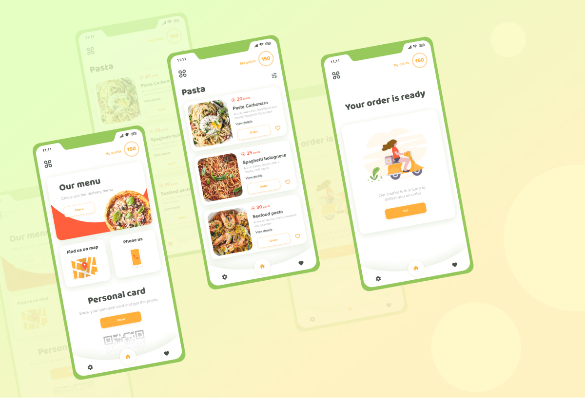

# pastarooma

Restaurant food delivery application.

This project is a UI integration with Flutter.

## Getting Started

- Clone the repo.
- Install dependencies
- And run the the app

## Design credit:
Amazing design work!
[Atilog - Free Mobile APP UI kit](https://www.behance.net/gallery/93705559/Atilog-Free-Mobile-APP-UI-kit), which offers tutorials,
samples, guidance on mobile development, and a full API reference.

